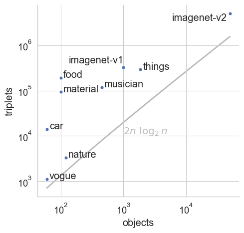

# cblearn-benchmark

This repository contains a small empirical comparison of algorithm implementations in [cblearn](https://github.com/dekuenstle/cblearn)
with each other and with implementations in different libraries.

At the moment, only ordinal embedding algorithms are evaluated.


Here you find some [results](./results.md).

## Preparation

### Setup a conda environment

```sh
conda create -n cblearn python==3.10
conda activate cblearn

conda install h5py seaborn tqdm pandas
conda install -c conda-forge adjusttext
pip install git+https://github.com/dekuenstle/cblearn.git#egg=cblearn[torch]
pip install jupyterlab
```

### Download the datasets

The data will be stored in `./datasets`; the path can be customized with the environment variable `CBLEARN_DATA`.
(this might take a few minutes)

```sh
conda activate cblearn
python scripts/datasets.py
```

## Run benchmark


### On a compute cluster (recommended)

#### Python (via conda)

1. `conda activate cblearn`
2. `cat runs/py.sh | xargs -L1 sbatch slurm/batchjob.sh`

#### Matlab (via singularity)

1. Download [van der Maaten's STE scripts](https://lvdmaaten.github.io/ste/Stochastic_Triplet_Embedding.html) and extract to `lib/vanderMaaten_STE`
2. Adjust matlab license file/server in `slurm/mat-batchjob.sh`
3. `cat runs/mat.sh | tr '\n' '\0' | xargs -0n1 sbatch slurm/mat-batchjob.sh` or
    `singularity run --bind ${PWD}:/home/docker --pwd /home/docker --env MLM_LICENSE_FILE=27000@matlab-campus.uni-tuebingen.de docker://mathworks/matlab:r2022a matlab -sd scripts/ -batch "embedding('STE', 'car');"` or (if matlab is available on your system) `sh runs/mat.sh`

sh /mnt/qb/work/wichmann/dkuenstle56/cblearn-benchmark/slurm/mat-batchjob.sh "matlab -sd scripts/ -batch 'disp(\"GNMDS\", \"car\");'"
sbatch slurm/mat-batchjob.sh matlab -sd scripts/ -batch "'embedding(\"STE\", \"material\");'"


singularity run --bind ${PWD}:/home/docker --pwd /home/docker --env MLM_LICENSE_FILE=27000@matlab-campus.uni-tuebingen.de docker://mathworks/matlab:r2022a matlab -sd scripts/ -batch "embedding('STE', 'car');"
#### R

1. Start R and install dependencies. If you are asked, if you want to use a personal library, respond "yes".

    ```sh
    R
    > install.packages(c('docopt', 'jsonlite', 'MLDS', 'loe'), dependencies=TRUE, repos='http://cran.r-project.org/')
    ... yes
    ... yes
    > q()
    ```
3. `cat runs/r.sh | xargs -L1 sbatch slurm/batchjob.sh` or `sh runs/r.sh` or `Rscript scripts/embedding.R SOE car`

Workaround on our HPC:
```
echo $SCRATCH
    /scratch_local/<foo>
mkdir $SCRATCH/r-lib
R
> install.packages(c('docopt', 'jsonlite', 'MLDS', 'loe'), dependencies=TRUE, repos='http://cran.r-project.org/', lib='/scratch_local/<foo>/r-lib')
> q()
cp -a $SCRATCH/r-lib/* ~/R/x86_64-redhat-linux-gnu-library/3.6/
```

### Manual

#### Python
1. Install python environment as described above.
2. `conda activate cblearn`
2. Run a single model, e.g. `python scripts/embedding.py SOE car`, or all models `sh runs/py.sh`

#### R

1. Install R (tested with 4.2)
2. Install dependencies in R.
    ```R
    install.packages(c('docopt', 'rjson', 'MLDS', 'loe'), dependencies=TRUE, repos='http://cran.rstudio.com/')
    ```
3. Run a single model, e.g. `Rscript scripts/embedding.R SOE car`, or all models `sh runs/r.sh`

#### Matlab (in a container)
```
# singularity:
singularity run --env MLM_LICENSE_FILE=27000@matlab-campus.uni-tuebingen.de docker://mathworks/matlab:r2022a

# or docker:
docker run -it --rm -p 8888:8888 -e MLM_LICENSE_FILE=27000@matlab-campus.uni-tuebingen.de --shm-size=512M mathworks/matlab:r2022a
```

## Plotting

Plots that visualize the datasets and the comparison's results, like the ones in the paper, are generated with jupyter notebooks.

Start jupyter `jupyter lab .`, and then run the following notebooks:

* `scripts/plot_datasets.ipynb` 


## Libraries and Algorithms:

**R-language** `R embedding.R <algo> <dataset> <result>`

* [MLDS](https://cran.r-project.org/web/packages/MLDS/index.html): MLDS algorithm
* [loe](https://cran.r-project.org/web/packages/loe/index.html): SOE algorithm

**Matlab** `matlab embedding.m -r "embedding <algo> <dataset> <result>"`

* [STE](https://lvdmaaten.github.io/ste/Stochastic_Triplet_Embedding.html): CKL[-K], GNMDS[-K], STE[-K], and tSTE algorithms.

**Python**


* [cblearn](https://github.com/dekuenstle/cblearn): MLDS, CKL-X, GNMDS-X, SOE, STE-X, tSTE CKL-GPU[-K], FORTE-GPU[-K], GNMDS-GPU[-K], SOE-GPU, STE-GPU, tSTE-GPU

## Dependencies

### R Dependencies

* [docopt.R](https://github.com/docopt/docopt.R): Command line interface
* [rjson](https://cran.r-project.org/web/packages/rjson/index.html): JSON loading
* [MLDS](https://cran.r-project.org/web/packages/MLDS/index.html): MLDS Algorithm
* [loe](https://cran.r-project.org/web/packages/loe/index.html): SOE Algorithm

If you don't run the scripts with containers, you can manually install
these dependencies to your local R instance with `install.packages(...)`.


## Missing data

We run each algorithm and dataset on a separate cluster entity with 96GB RAM and maximum 24h runtime. Runs that exceeded these limitations failed intentionally. For example, our *FORTE-GPU* algorithm requires too much memory and thus fails on the large *imagenet-v2* dataset.
Similarly, the *tSTE* algorithm of vanderMaaten  timed out on the *things* and *imagenet-v2* datasets.
The *R* implementation of *SOE* crashed for *imagenet-v2* because "long vectors" are not supported by some internal function.

# License

The scripts in this library are free to use under the MIT License conditions.
The plots are shared under [CC BY-SA 2.0](https://creativecommons.org/licenses/by-sa/2.0/) and require attribution.
