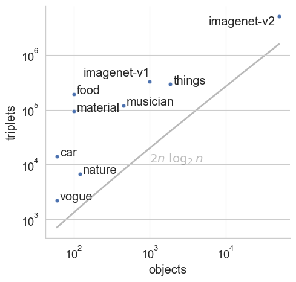
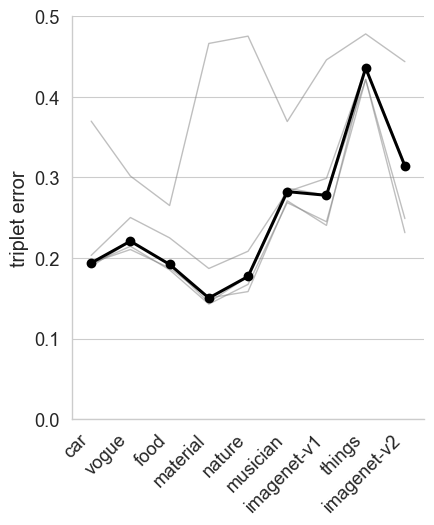
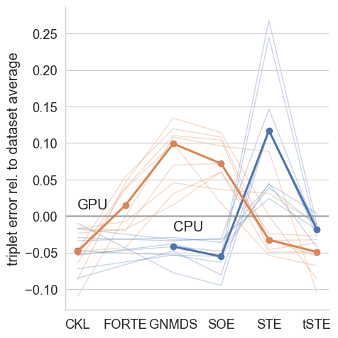
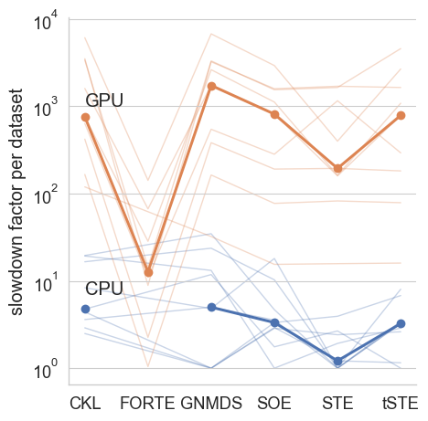
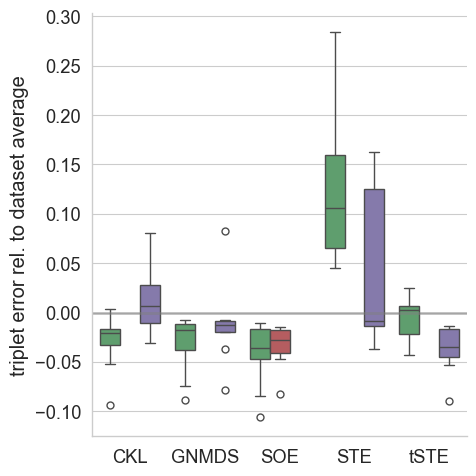
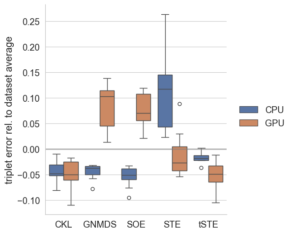
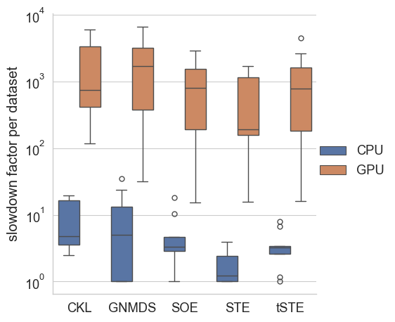
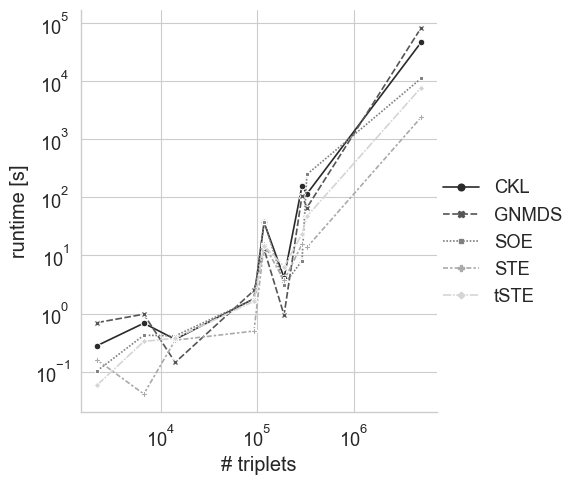
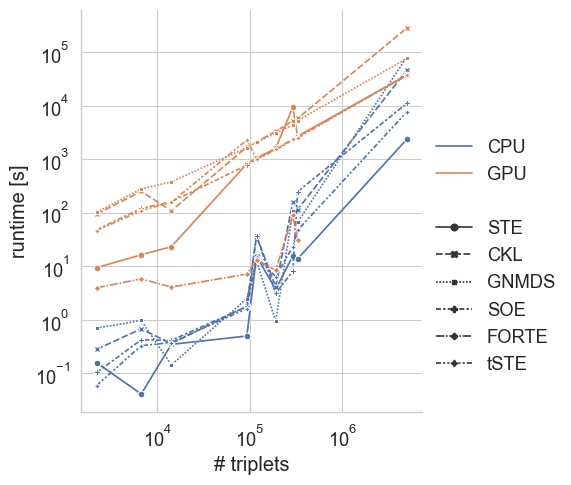

# Results

Here we show results from 2023-03-17. 

# Dataset overview

  

# Algorithm comparison by subgroups

The shown errors and runtimes are relative to the average performance of the shown subgroup.

| Error      | Time        |
|------------|-------------|
|  |   |
|  |  |
|  |  |
|  |  |

# Performance per number of triplets 

Here we see, that the used datasets are still too small for the GPU to be beneficial. 

 

